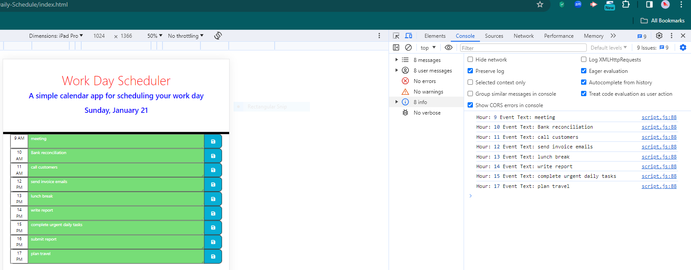

# Desktop-Daily-Schedule
## Features

- **Current Day Display:**
  - The current day is displayed at the top of the calendar.

- **Time Block Color Coding:**
  - Time blocks are color-coded based on whether they are in the past, present, or future.

- **Event Entry and Saving:**
  - Usr can to enter an event when they click a timeblock and save events in local storage when save button is clicked in that timeblock.

- **Local Storage Persistence:**
  - Saved events persist between page refreshes.
  - 
  - **Difficulties Encountered:**
During the development of this project, I encountered the following difficulties:
    Color-Coding Logic:
        Implementing the dynamic color-coding logic for time blocks based on the current time posed a challenge. 
    Event Saving and Retrieval:
        Implementing the functionality to save events to local storage.
        
- **Dependencies**
    jQuery: JavaScript library for DOM manipulation.
    dayjs: Modern JavaScript date utility library.

- **This project is licensed under the MIT License.**
 - **Links**
 github:https://github.com/RusLena/Desktop-Daily-Schedule.git
 URL:https://ruslena.github.io/Desktop-Daily-Schedule/
 Screenshot: 
